# Noi Technical Architecture

## Table of Contents
- [System Overview](#system-overview)
- [Core Components](#core-components)
- [Extension System](#extension-system)
- [Data Flow](#data-flow)
- [Configuration Management](#configuration-management)
- [Build & Deployment](#build--deployment)
- [Development Workflow](#development-workflow)

## System Overview

Noi is an AI-enhanced, customizable browser built on Electron that provides seamless integration with multiple AI services and platforms. The application follows a modular architecture with clear separation of concerns.

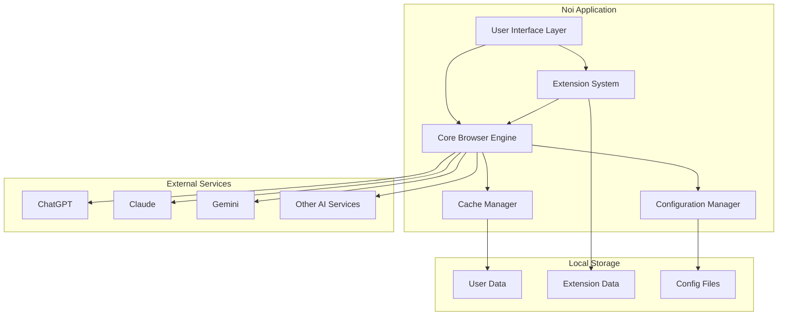

### Key Architectural Principles

1. **Modularity**: Each component has a specific responsibility and clear interfaces
2. **Extensibility**: Plugin-based architecture allows for easy feature additions
3. **Isolation**: Cookie data isolation supports multiple accounts per service
4. **Performance**: Cache mode optimizes browsing experience
5. **Customization**: Comprehensive configuration system for user preferences

## Core Components

The Noi application consists of several core components that work together to provide the AI-enhanced browsing experience.

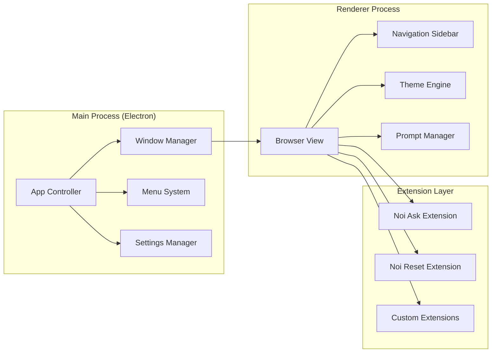

### Component Responsibilities

- **App Controller**: Main application lifecycle management
- **Window Manager**: Browser window creation and management
- **Menu System**: Application menus and shortcuts
- **Settings Manager**: User preferences and configuration
- **Browser View**: Web content rendering and navigation
- **Navigation Sidebar**: AI service shortcuts and navigation
- **Theme Engine**: UI theming and customization
- **Prompt Manager**: Prompt storage and management

## Extension System

Noi supports a Chrome-like extension system that allows for enhanced functionality and customization.

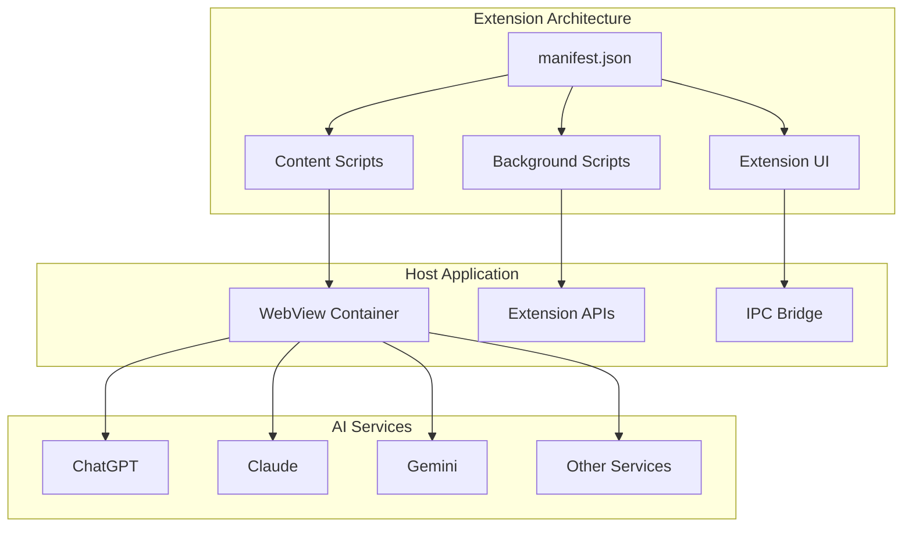

### Extension Types

1. **@noi/ask**: Batch messaging and prompt management
2. **@noi/ask-custom**: Custom prompt templates
3. **@noi/reset**: Website style resets for compatibility

### Extension Lifecycle

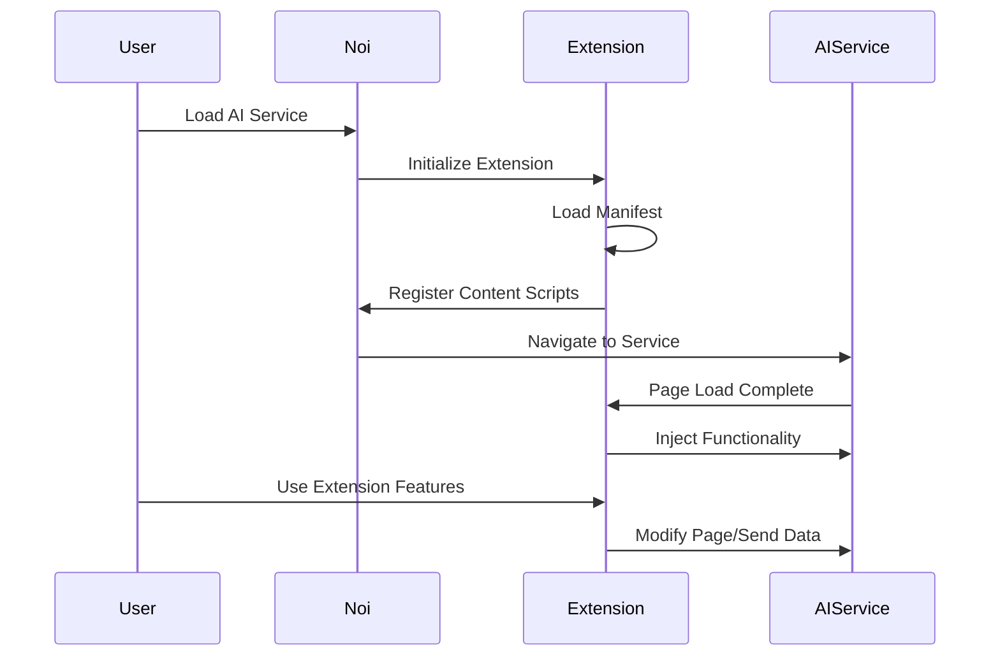

## Data Flow

Understanding how data flows through the Noi application is crucial for developers and system administrators.

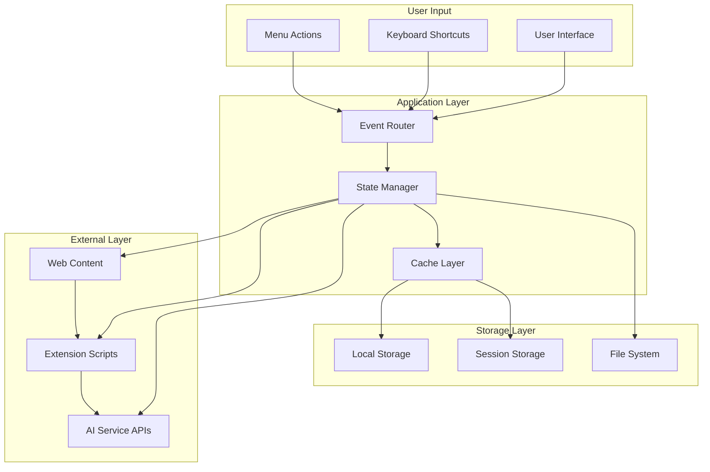

### Data Flow Patterns

1. **User Interaction Flow**: UI events → State management → Action execution
2. **Configuration Flow**: Settings changes → Config validation → File storage
3. **Extension Data Flow**: Extension events → IPC → Main process → Storage
4. **AI Service Flow**: User requests → Extension processing → AI API calls

## Configuration Management

Noi uses a flexible configuration system to manage user preferences and AI service integrations.

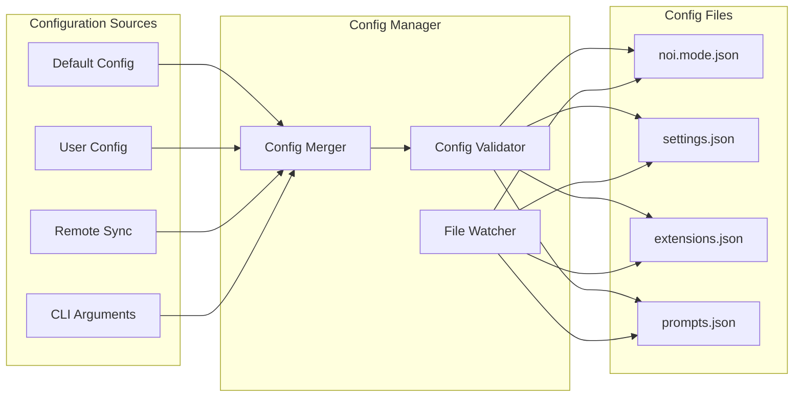

### Configuration Schema

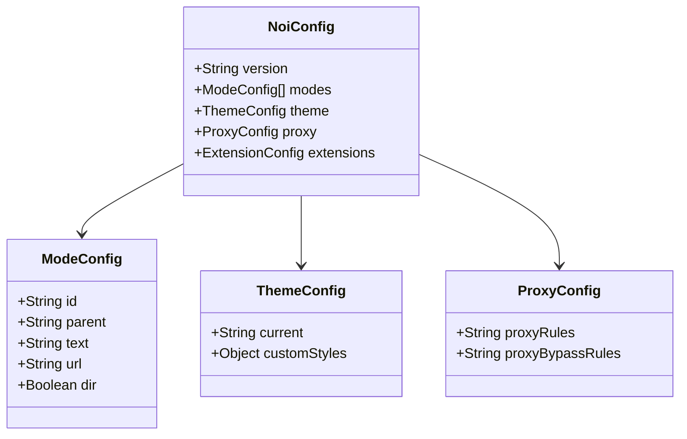

## Build & Deployment

The Noi project uses a multi-stage build and deployment process optimized for cross-platform distribution.

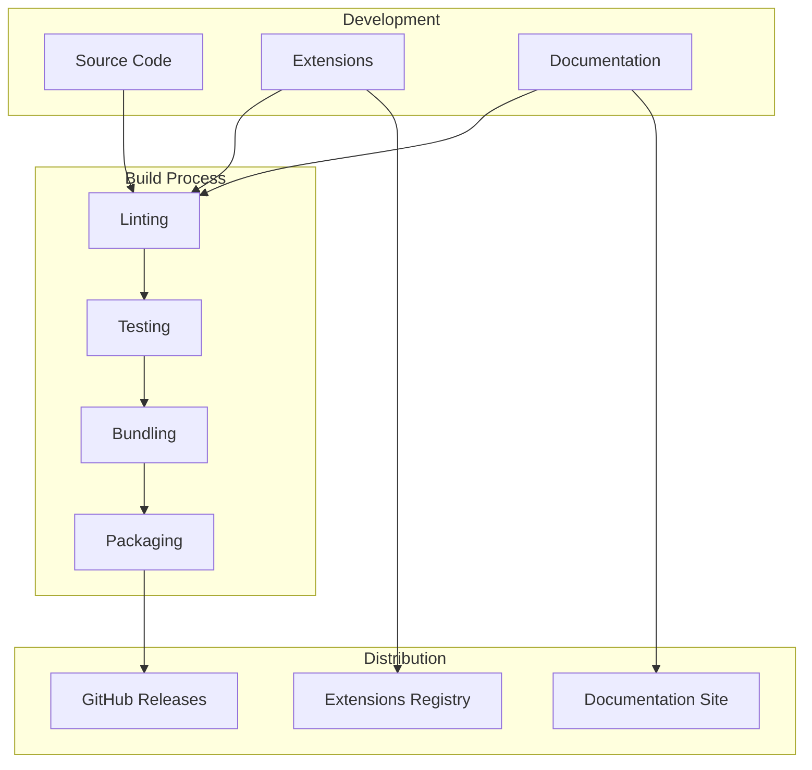

### Build Targets

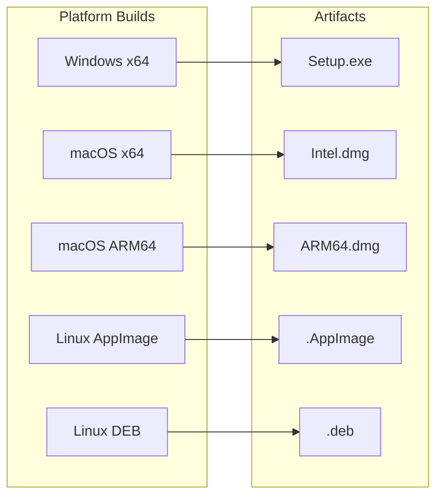

## Development Workflow

The development workflow is designed to support rapid iteration while maintaining code quality.

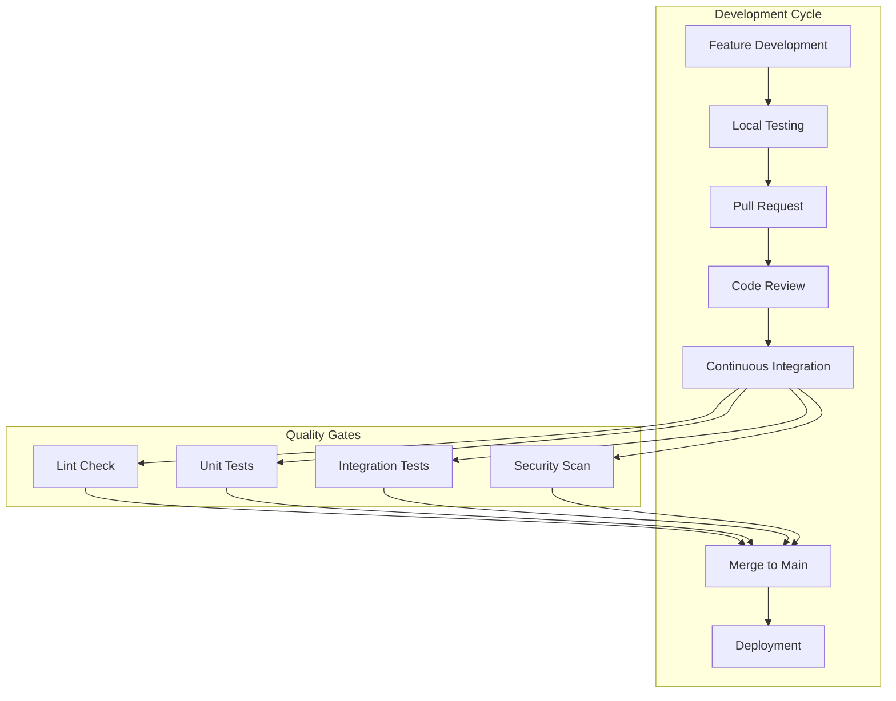

### Development Environment Setup

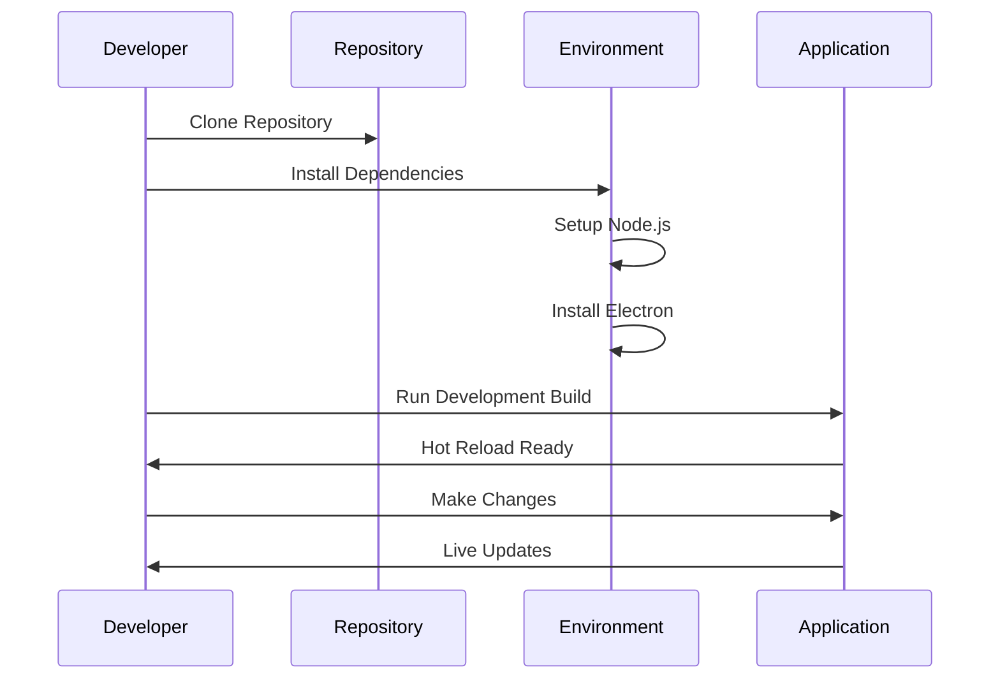

## Security Considerations

Noi implements several security measures to protect user data and ensure safe browsing.

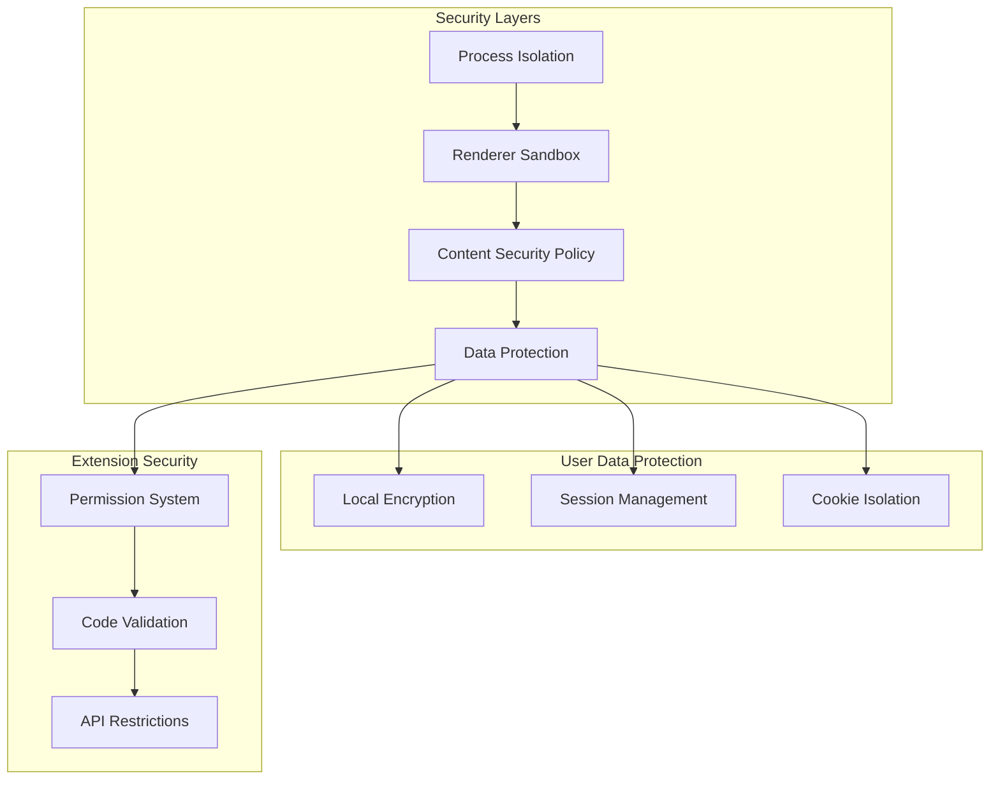

## Performance Optimization

Noi implements several performance optimization strategies to ensure smooth user experience.

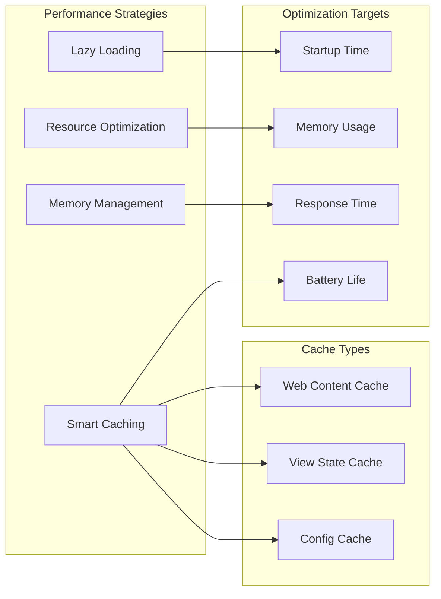

## Future Architecture Considerations

As Noi evolves, several architectural improvements are being considered:

1. **Microservices Architecture**: Breaking down monolithic components
2. **Plugin Marketplace**: Centralized extension distribution
3. **Cloud Sync**: Cross-device synchronization
4. **Mobile Support**: React Native or Flutter implementation
5. **AI Model Integration**: Local AI model support

This architecture document serves as a living guide for understanding and contributing to the Noi project. It will be updated as the system evolves and new features are added.