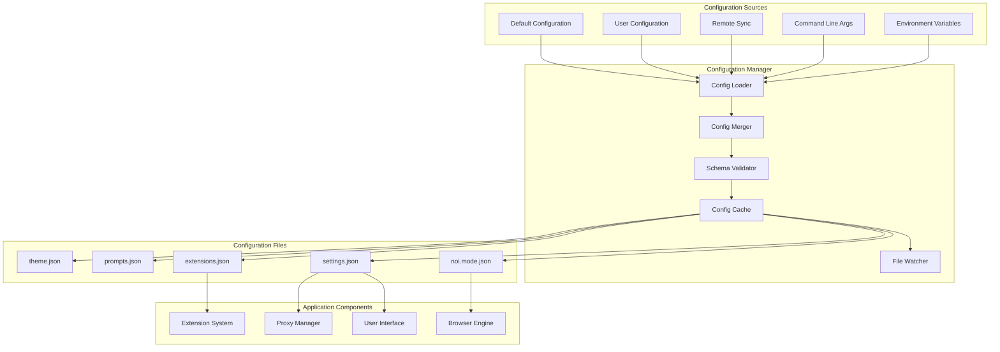
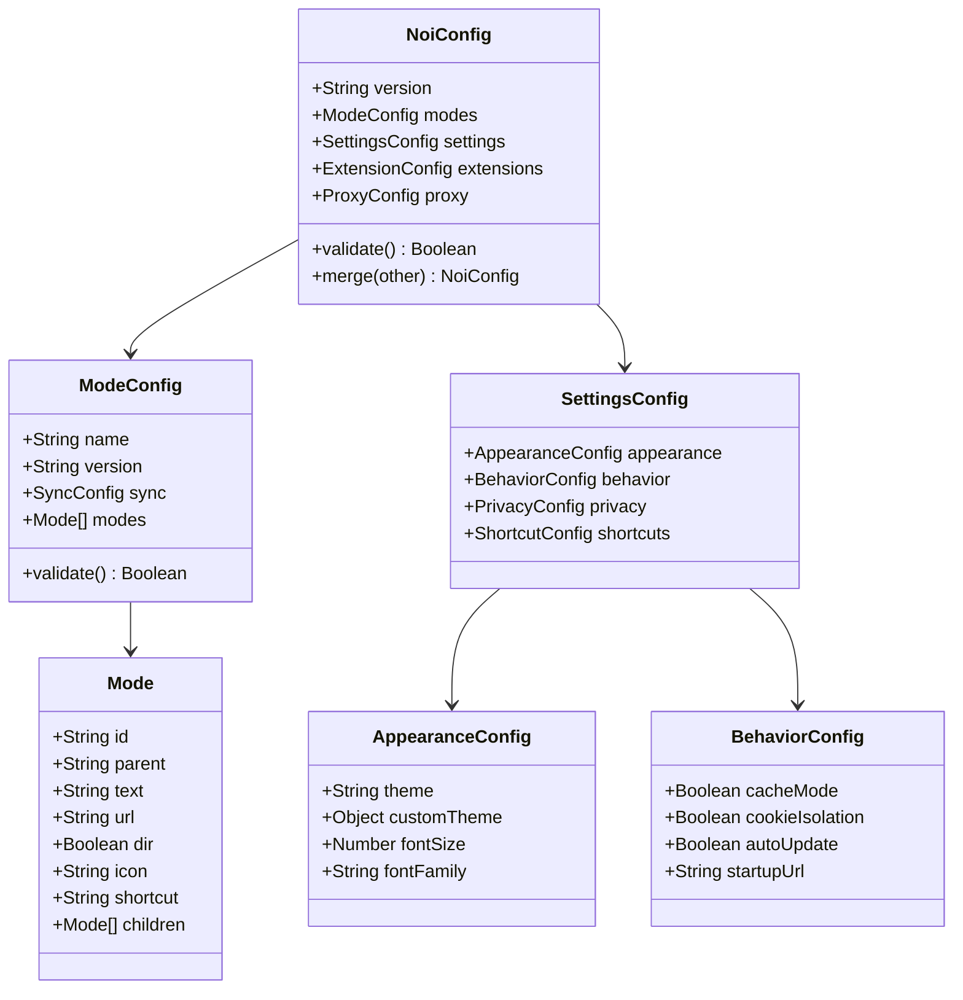
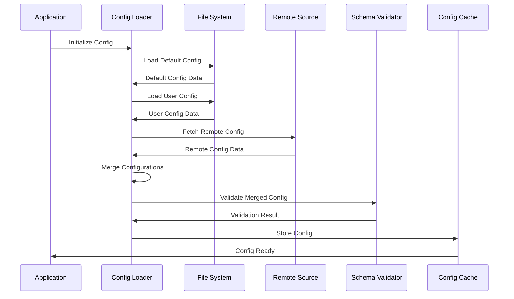
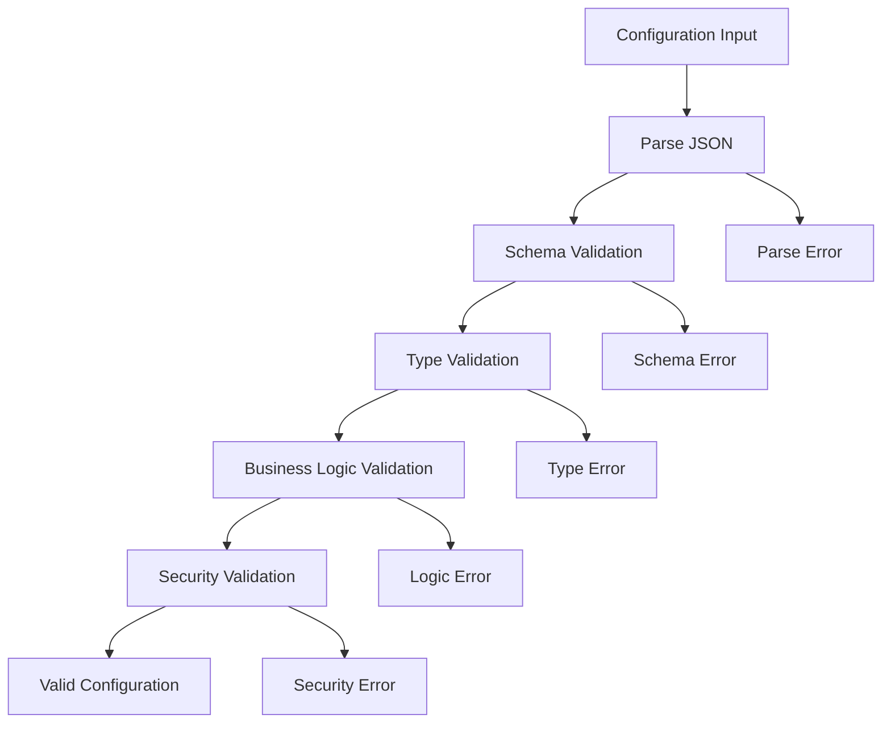
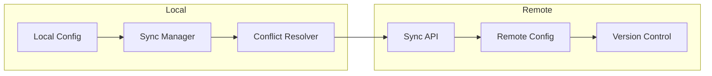
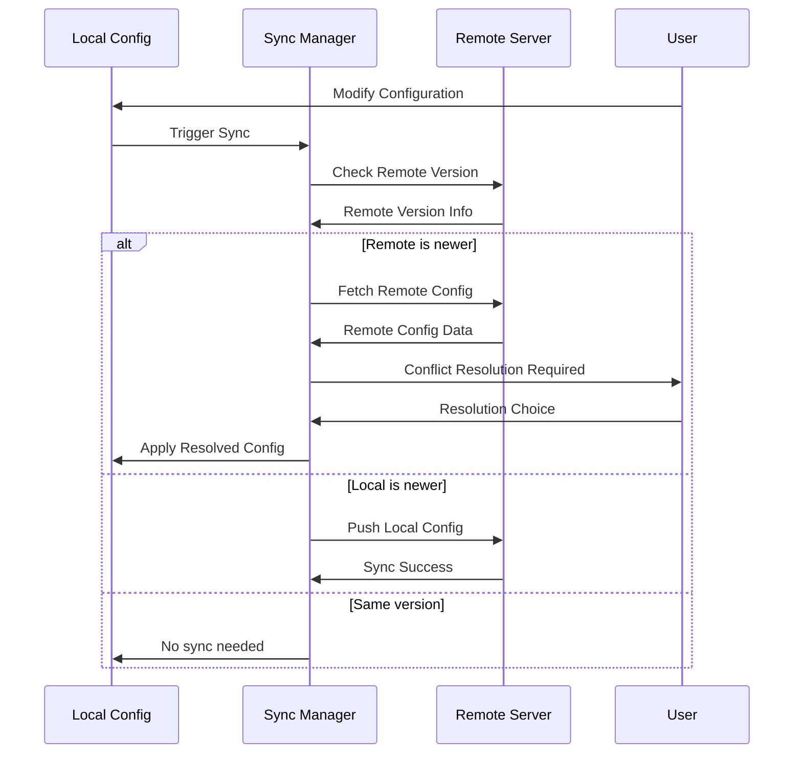
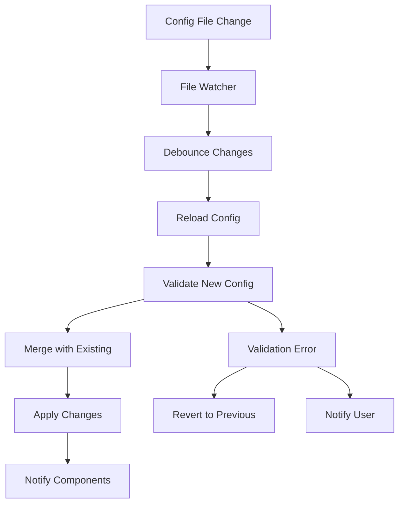
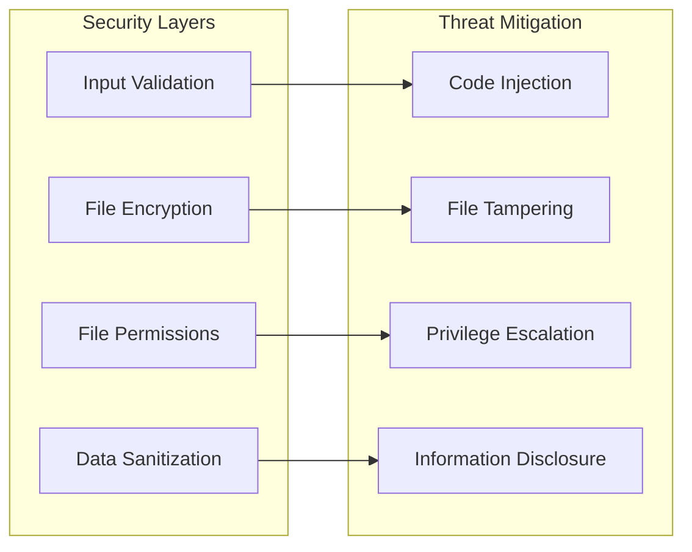

# Configuration System Documentation

## Overview

Noi's configuration system provides a flexible and extensible way to manage application settings, AI service configurations, and user preferences. The system supports multiple configuration sources, validation, and real-time updates.

## Configuration Architecture



## Configuration Files

### 1. Mode Configuration (`noi.mode.json`)

Defines AI services and navigation structure:

```json
{
  "name": "Noi Modes",
  "version": "1.0.0",
  "sync": {
    "url": "https://raw.githubusercontent.com/lencx/Noi/main/configs/noi.mode.json",
    "timestamp": "2024-01-15T10:30:00Z"
  },
  "modes": [
    {
      "id": "chatgpt",
      "parent": "ai-chat",
      "text": "ChatGPT",
      "url": "https://chatgpt.com",
      "dir": false,
      "icon": "openai",
      "shortcut": "cmd+1"
    },
    {
      "id": "ai-chat",
      "text": "AI Chat Services",
      "dir": true,
      "children": ["chatgpt", "claude", "gemini"]
    }
  ]
}
```

### 2. Application Settings (`settings.json`)

User preferences and application configuration:

```json
{
  "appearance": {
    "theme": "system",
    "customTheme": {
      "primary": "#007acc",
      "secondary": "#f0f0f0"
    },
    "fontSize": 14,
    "fontFamily": "system"
  },
  "behavior": {
    "cacheMode": true,
    "cookieIsolation": true,
    "autoUpdate": true,
    "startupUrl": "noi://home"
  },
  "privacy": {
    "clearDataOnExit": false,
    "blockTrackers": true,
    "enableDNT": true
  },
  "shortcuts": {
    "newTab": "cmd+t",
    "closeTab": "cmd+w",
    "toggleSidebar": "cmd+b"
  }
}
```

### 3. Extension Configuration (`extensions.json`)

Extension settings and registry:

```json
{
  "registry": {
    "official": "https://noi.lencx.dev/extensions",
    "community": "https://github.com/noi-extensions"
  },
  "installed": [
    {
      "id": "@noi/ask",
      "version": "0.2.2",
      "enabled": true,
      "settings": {
        "autoSave": true,
        "batchSize": 5
      }
    }
  ],
  "permissions": {
    "storage": ["@noi/ask"],
    "tabs": ["@noi/reset"]
  }
}
```

## Configuration Schema



## Configuration Loading Process



## Configuration Validation

### Schema Validation

```javascript
// Example schema validation
const configSchema = {
  type: "object",
  properties: {
    version: { type: "string", pattern: "^\\d+\\.\\d+\\.\\d+$" },
    modes: {
      type: "array",
      items: {
        type: "object",
        properties: {
          id: { type: "string", minLength: 1 },
          text: { type: "string", minLength: 1 },
          url: { type: "string", format: "uri" },
          dir: { type: "boolean" }
        },
        required: ["id", "text"]
      }
    }
  },
  required: ["version", "modes"]
};
```

### Validation Flow



## Configuration Synchronization

### Remote Sync Architecture



### Sync Process



## Configuration Hot Reloading



## Configuration API

### Reading Configuration

```javascript
// Get configuration value
const theme = noi.config.get('appearance.theme');

// Get with default value
const fontSize = noi.config.get('appearance.fontSize', 14);

// Get entire section
const appearance = noi.config.get('appearance');
```

### Writing Configuration

```javascript
// Set single value
noi.config.set('appearance.theme', 'dark');

// Set multiple values
noi.config.set({
  'appearance.theme': 'dark',
  'appearance.fontSize': 16
});

// Update with validation
try {
  await noi.config.update('behavior.cacheMode', true);
} catch (error) {
  console.error('Invalid configuration:', error);
}
```

### Watching Configuration Changes

```javascript
// Watch specific key
noi.config.watch('appearance.theme', (newValue, oldValue) => {
  console.log(`Theme changed from ${oldValue} to ${newValue}`);
});

// Watch section
noi.config.watch('appearance.*', (changes) => {
  console.log('Appearance settings changed:', changes);
});

// Watch all changes
noi.config.watch('*', (changes) => {
  console.log('Configuration changed:', changes);
});
```

## Configuration Security

### Secure Storage



### Security Best Practices

1. **Encrypt sensitive data**: API keys, tokens, and personal information
2. **Validate all inputs**: Never trust user-provided configuration data
3. **Sandbox configuration**: Limit configuration access to authorized components
4. **Audit configuration changes**: Log all configuration modifications
5. **Regular backups**: Maintain configuration backups for recovery

## Configuration Migration

### Version Migration

```javascript
// Migration example
class ConfigMigration {
  static migrations = {
    '1.0.0': (config) => {
      // Migrate from v0.x to v1.0.0
      if (config.theme) {
        config.appearance = { theme: config.theme };
        delete config.theme;
      }
      return config;
    },
    '1.1.0': (config) => {
      // Migrate from v1.0.0 to v1.1.0
      if (!config.behavior) {
        config.behavior = {
          cacheMode: true,
          cookieIsolation: false
        };
      }
      return config;
    }
  };
  
  static migrate(config, targetVersion) {
    const currentVersion = config.version || '0.1.0';
    let migratedConfig = { ...config };
    
    for (const [version, migrationFn] of Object.entries(this.migrations)) {
      if (this.isVersionGreater(version, currentVersion)) {
        migratedConfig = migrationFn(migratedConfig);
      }
    }
    
    migratedConfig.version = targetVersion;
    return migratedConfig;
  }
}
```

## Troubleshooting

### Common Issues

1. **Configuration not loading**: Check file permissions and syntax
2. **Invalid JSON**: Use a JSON validator to check syntax
3. **Schema validation errors**: Review the configuration schema
4. **Sync conflicts**: Use conflict resolution strategies
5. **Performance issues**: Optimize configuration size and structure

### Debug Tools

```javascript
// Enable configuration debugging
noi.config.setDebugMode(true);

// Export current configuration
const config = noi.config.export();
console.log('Current configuration:', config);

// Validate configuration
const isValid = noi.config.validate();
console.log('Configuration is valid:', isValid);
```

## Best Practices

1. **Use semantic versioning**: Follow semantic versioning for configuration schemas
2. **Provide defaults**: Always provide sensible default values
3. **Document changes**: Document configuration changes and migrations
4. **Test migrations**: Thoroughly test configuration migrations
5. **Backup before changes**: Always backup configuration before major changes
6. **Use validation**: Implement comprehensive validation for all configuration data
7. **Monitor performance**: Keep configuration access performant
8. **Secure sensitive data**: Encrypt and protect sensitive configuration data

This documentation provides a comprehensive guide to Noi's configuration system. For more specific implementation details, refer to the source code and API documentation.