# Development & Deployment Guide

## Overview

This guide provides comprehensive information for developers who want to contribute to Noi, set up development environments, and understand the build and deployment processes.

## Development Environment Setup

### Prerequisites

- **Node.js**: Version 18 or higher
- **Git**: For version control
- **Platform-specific tools**:
  - **Windows**: Visual Studio Build Tools
  - **macOS**: Xcode Command Line Tools
  - **Linux**: Build essentials

### Local Development Setup

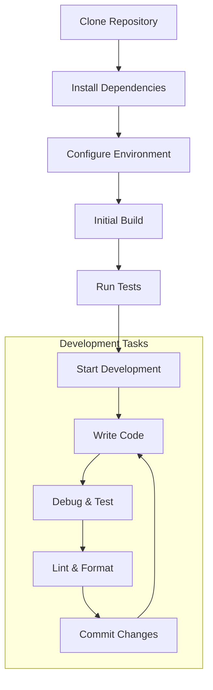

### Step-by-Step Setup

```bash
# 1. Clone the repository
git clone https://github.com/lencx/Noi.git
cd Noi

# 2. Install dependencies
npm install

# 3. Set up development environment
cp .env.example .env
# Edit .env with your configuration

# 4. Start development server
npm run dev

# 5. Run tests
npm test

# 6. Build for production
npm run build
```

## Project Structure

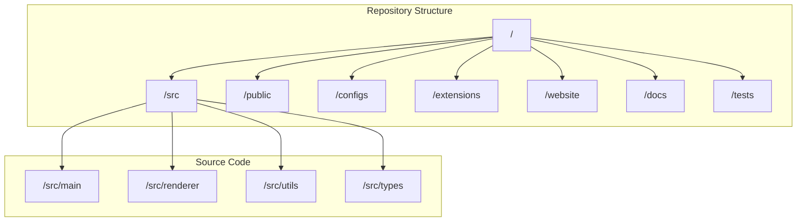

### Directory Breakdown

- **`/src/main`**: Electron main process code
- **`/src/renderer`**: Electron renderer process code
- **`/src/utils`**: Shared utilities and helpers
- **`/src/types`**: TypeScript type definitions
- **`/configs`**: Default configuration files
- **`/extensions`**: Built-in extensions
- **`/website`**: Documentation website (Docusaurus)
- **`/docs`**: Technical documentation
- **`/tests`**: Test suites and test utilities

## Development Workflow

### Git Workflow

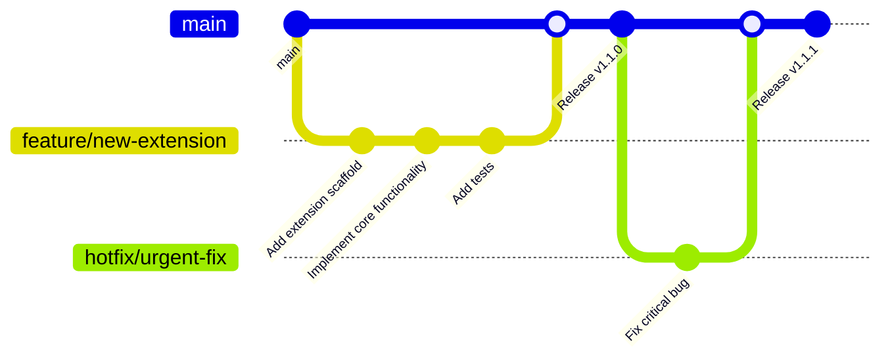

### Branch Strategy

- **`main`**: Production-ready code
- **`develop`**: Integration branch for features
- **`feature/*`**: New features and enhancements
- **`bugfix/*`**: Bug fixes
- **`hotfix/*`**: Critical fixes for production
- **`release/*`**: Release preparation

### Code Quality Gates

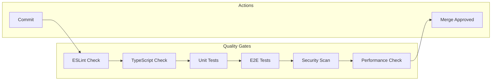

## Build System

### Build Architecture

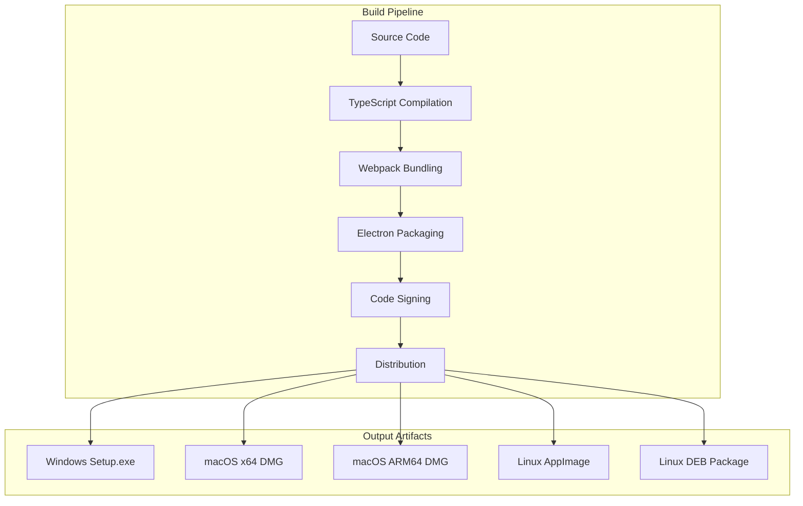

### Build Commands

```bash
# Development build
npm run build:dev

# Production build
npm run build:prod

# Platform-specific builds
npm run build:win      # Windows
npm run build:mac      # macOS Universal
npm run build:mac:x64  # macOS Intel
npm run build:mac:arm64 # macOS Apple Silicon
npm run build:linux    # Linux AppImage
npm run build:linux:deb # Linux DEB

# Build all platforms
npm run build:all
```

### Build Configuration

```javascript
// build.config.js
module.exports = {
  productName: 'Noi',
  appId: 'com.lencx.noi',
  directories: {
    output: 'dist',
    app: 'app'
  },
  files: [
    'app/**/*',
    'node_modules/**/*',
    '!node_modules/*/{CHANGELOG.md,README.md,readme.md}',
    '!node_modules/.bin',
    '!**/*.{iml,o,hprof,orig,pyc,pyo,rbc,swp,csproj,sln,xproj}'
  ],
  mac: {
    category: 'public.app-category.productivity',
    target: [
      { target: 'dmg', arch: ['x64', 'arm64'] },
      { target: 'zip', arch: ['x64', 'arm64'] }
    ]
  },
  win: {
    target: [
      { target: 'nsis', arch: ['x64'] },
      { target: 'portable', arch: ['x64'] }
    ]
  },
  linux: {
    target: [
      { target: 'AppImage', arch: ['x64'] },
      { target: 'deb', arch: ['x64'] }
    ]
  }
};
```

## Continuous Integration

### CI/CD Pipeline

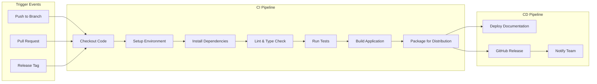

### GitHub Actions Workflow

```yaml
# .github/workflows/ci.yml
name: CI/CD Pipeline

on:
  push:
    branches: [main, develop]
  pull_request:
    branches: [main]
  release:
    types: [published]

jobs:
  test:
    runs-on: ubuntu-latest
    steps:
      - uses: actions/checkout@v3
      - uses: actions/setup-node@v3
        with:
          node-version: '18'
          cache: 'npm'
      
      - run: npm ci
      - run: npm run lint
      - run: npm run type-check
      - run: npm test
      - run: npm run test:e2e

  build:
    needs: test
    strategy:
      matrix:
        os: [ubuntu-latest, windows-latest, macos-latest]
    
    runs-on: ${{ matrix.os }}
    steps:
      - uses: actions/checkout@v3
      - uses: actions/setup-node@v3
        with:
          node-version: '18'
          cache: 'npm'
      
      - run: npm ci
      - run: npm run build
      - run: npm run package
      
      - uses: actions/upload-artifact@v3
        with:
          name: noi-${{ matrix.os }}
          path: dist/
```

## Testing Strategy

### Test Pyramid

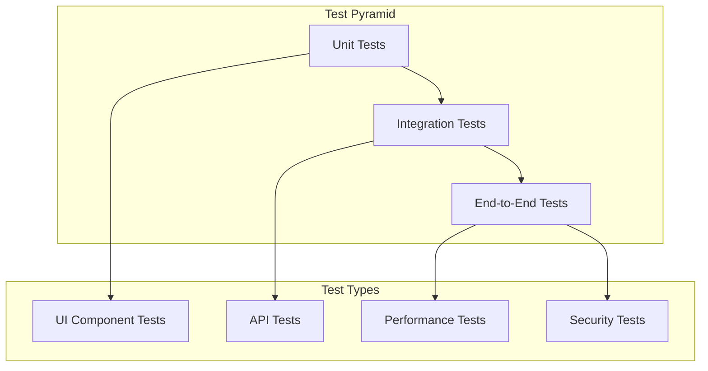

### Testing Framework

```javascript
// Unit test example (Jest)
describe('ConfigManager', () => {
  let configManager;
  
  beforeEach(() => {
    configManager = new ConfigManager();
  });
  
  it('should load default configuration', () => {
    const config = configManager.getDefault();
    expect(config).toBeDefined();
    expect(config.version).toMatch(/^\d+\.\d+\.\d+$/);
  });
  
  it('should validate configuration schema', () => {
    const validConfig = { version: '1.0.0', modes: [] };
    expect(configManager.validate(validConfig)).toBe(true);
    
    const invalidConfig = { version: 'invalid' };
    expect(configManager.validate(invalidConfig)).toBe(false);
  });
});
```

### E2E Testing

```javascript
// E2E test example (Playwright)
describe('Application Launch', () => {
  let app;
  
  beforeAll(async () => {
    app = await electron.launch({
      args: ['./dist/main.js']
    });
  });
  
  afterAll(async () => {
    await app.close();
  });
  
  it('should display main window', async () => {
    const window = await app.firstWindow();
    expect(await window.title()).toBe('Noi');
  });
  
  it('should load AI services', async () => {
    const window = await app.firstWindow();
    await window.click('[data-testid="chatgpt-link"]');
    await window.waitForLoadState('networkidle');
    expect(window.url()).toContain('chatgpt.com');
  });
});
```

## Performance Optimization

### Performance Monitoring

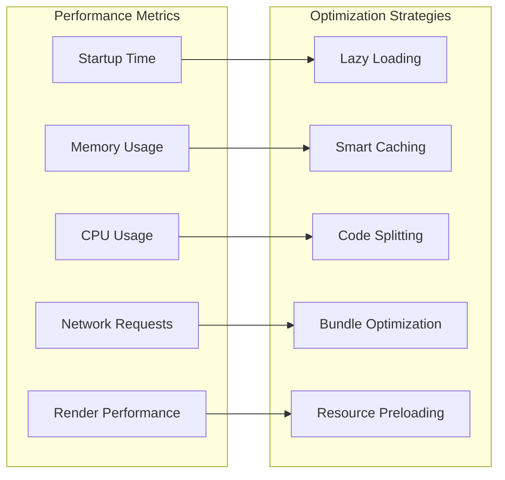

### Bundle Analysis

```bash
# Analyze bundle size
npm run analyze

# Performance profiling
npm run profile

# Memory leak detection
npm run test:memory
```

## Deployment Strategies

### Release Process

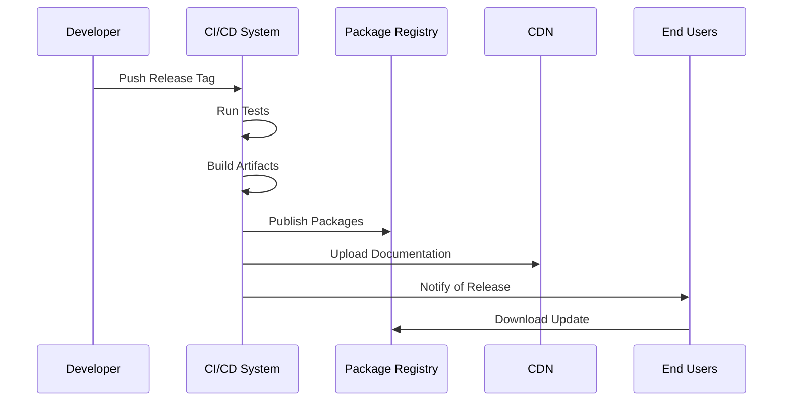

### Distribution Channels

1. **GitHub Releases**: Primary distribution channel
2. **Package Managers**: Platform-specific package managers
3. **Direct Download**: Website download links
4. **Auto-updater**: Built-in update mechanism

### Rollback Strategy

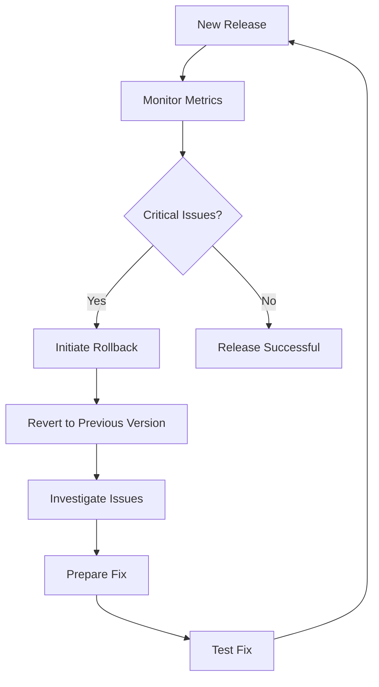

## Security Considerations

### Security Scanning

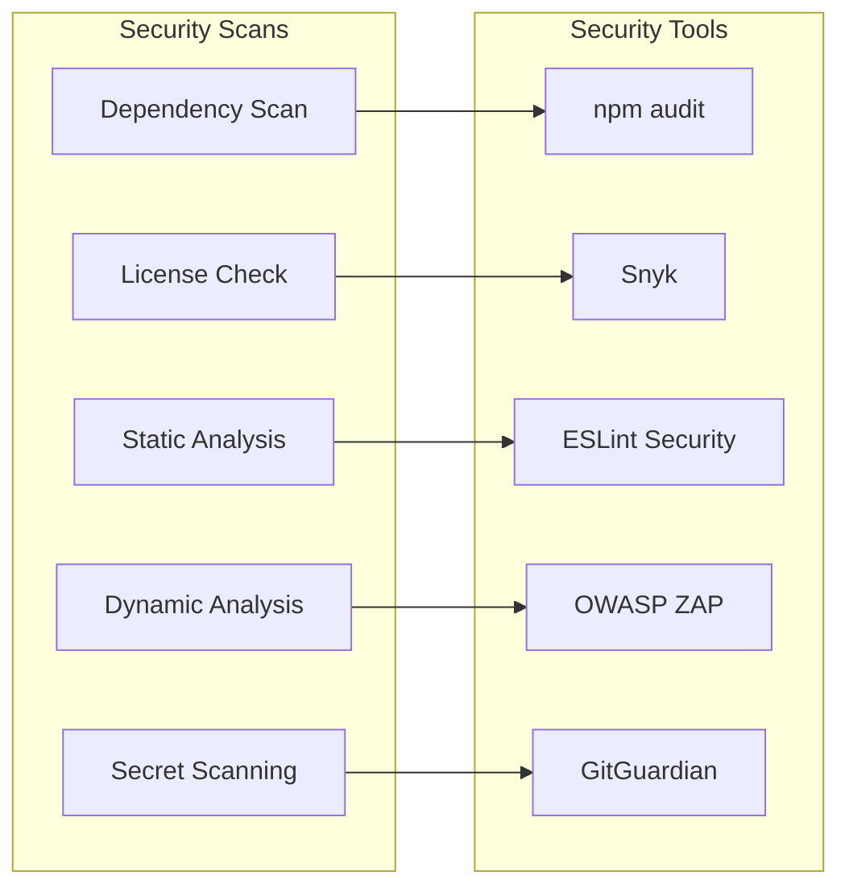

### Code Signing

```bash
# macOS code signing
codesign --force --verify --verbose --sign "Developer ID Application: Your Name" "Noi.app"

# Windows code signing
signtool sign /f certificate.p12 /p password /t http://timestamp.digicert.com "Noi Setup.exe"

# Verify signatures
codesign --verify --deep --strict "Noi.app"
signtool verify /pa "Noi Setup.exe"
```

## Troubleshooting

### Common Development Issues

1. **Build failures**: Check Node.js version and dependencies
2. **Test failures**: Ensure test environment is properly configured
3. **Performance issues**: Use profiling tools to identify bottlenecks
4. **Extension loading**: Verify manifest syntax and permissions
5. **Configuration errors**: Validate JSON syntax and schema

### Debug Tools

```javascript
// Enable debug mode
process.env.DEBUG = 'noi:*';

// Memory profiling
const { performance } = require('perf_hooks');
const start = performance.now();
// ... code to profile
const end = performance.now();
console.log(`Execution time: ${end - start} milliseconds`);

// Electron DevTools
// In main process
mainWindow.webContents.openDevTools();
```

## Contributing Guidelines

### Code Style

- Follow TypeScript best practices
- Use ESLint and Prettier for formatting
- Write descriptive commit messages
- Include tests for new features
- Update documentation for changes

### Pull Request Process

1. Fork the repository
2. Create a feature branch
3. Make your changes
4. Write tests
5. Update documentation
6. Submit pull request
7. Address review feedback
8. Merge when approved

### Community

- Join the Discord server for discussions
- Report bugs through GitHub issues
- Suggest features through GitHub discussions
- Contribute to documentation
- Help other users in the community

This guide provides a comprehensive overview of the development and deployment processes for Noi. For specific implementation details, refer to the source code and individual component documentation.