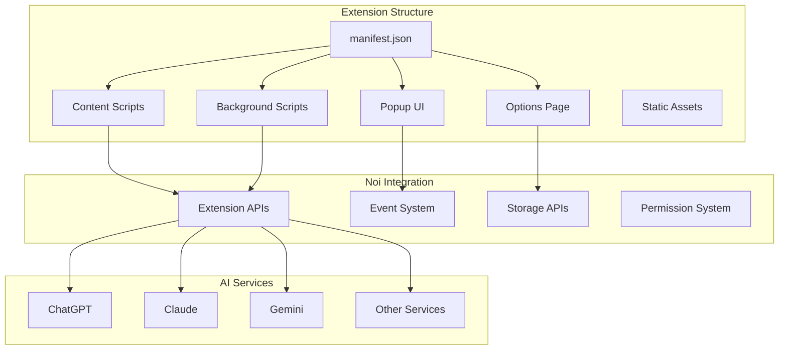
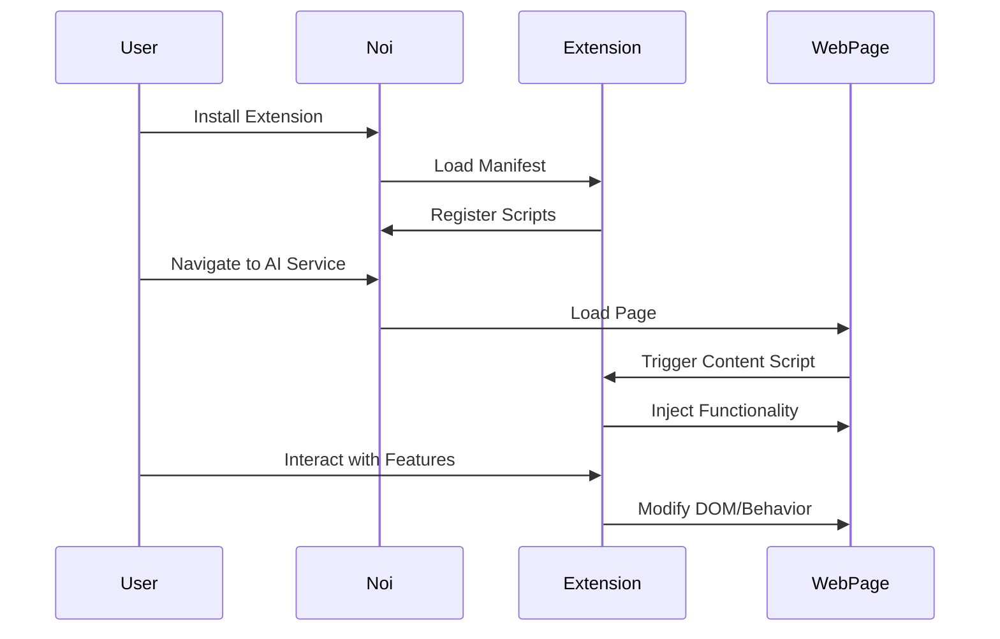
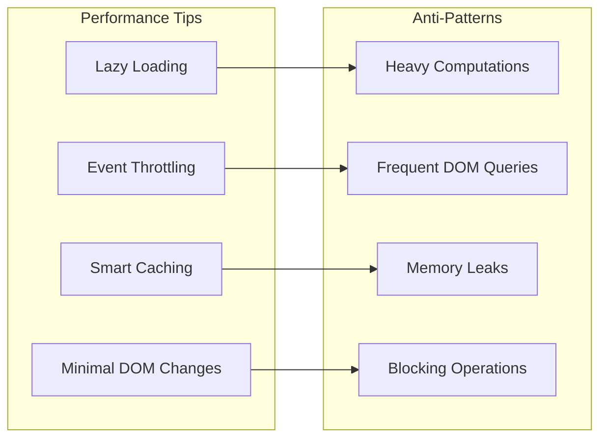
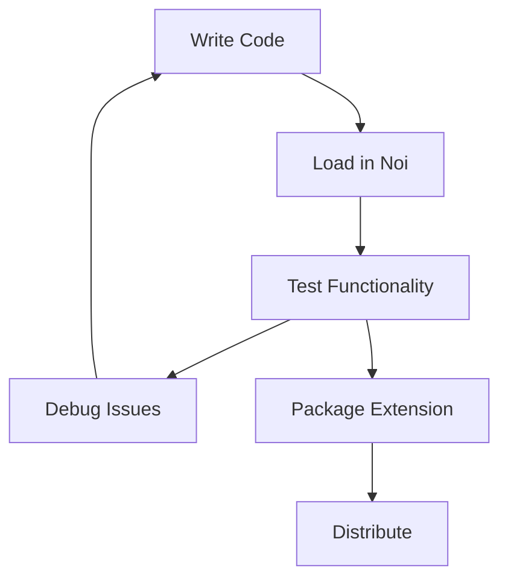
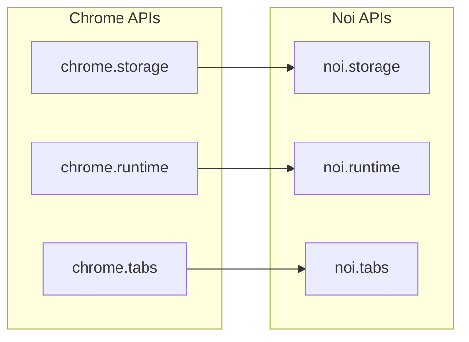

# Extension Development Guide

## Overview

This guide provides detailed information for developers who want to create extensions for Noi. The Noi extension system is based on the Chromium extension API, allowing developers to extend the functionality of the AI-enhanced browser.

## Extension Architecture



## Getting Started

### 1. Extension Manifest

Every Noi extension starts with a `manifest.json` file that declares its basic properties:

```json
{
  "manifest_version": 3,
  "name": "My Noi Extension",
  "version": "1.0.0",
  "description": "A sample extension for Noi",
  "content_scripts": [
    {
      "matches": [
        "https://chatgpt.com/*",
        "https://claude.ai/*"
      ],
      "js": ["content.js"],
      "run_at": "document_end"
    }
  ],
  "permissions": ["storage", "activeTab"],
  "action": {
    "default_popup": "popup.html",
    "default_title": "My Extension"
  }
}
```

### 2. Content Scripts

Content scripts run in the context of web pages and can interact with the DOM:

```javascript
// content.js
(function() {
    'use strict';
    
    // Wait for page to load
    if (document.readyState === 'loading') {
        document.addEventListener('DOMContentLoaded', init);
    } else {
        init();
    }
    
    function init() {
        // Add your functionality here
        addNoiButton();
    }
    
    function addNoiButton() {
        const button = document.createElement('button');
        button.textContent = 'Noi Extension';
        button.onclick = handleClick;
        document.body.appendChild(button);
    }
    
    function handleClick() {
        // Extension logic
        console.log('Noi extension activated!');
    }
})();
```

## Extension Lifecycle



## Supported AI Services

The following AI services are officially supported for extension development:

### Chat Services
- **ChatGPT**: `https://chatgpt.com/*`
- **Claude**: `https://claude.ai/*`
- **Gemini**: `https://gemini.google.com/*`
- **Grok**: `https://grok.com/*`
- **Poe**: `https://poe.com/*`

### Development Platforms
- **GitHub Copilot**: `https://github.com/copilot/*`
- **HuggingChat**: `https://huggingface.co/chat/*`
- **Perplexity**: `https://www.perplexity.ai/*`

### Chinese AI Services
- **通义千问**: `https://tongyi.aliyun.com/qianwen/*`
- **扣子**: `https://www.coze.cn/home/*`
- **豆包**: `https://www.doubao.com/*`
- **智谱清言**: `https://chatglm.cn/*`
- **DeepSeek**: `https://chat.deepseek.com/*`

## Extension APIs

### Storage API

```javascript
// Save data
noi.storage.local.set({key: 'value'}, function() {
    console.log('Data saved');
});

// Retrieve data
noi.storage.local.get(['key'], function(result) {
    console.log('Value:', result.key);
});
```

### Messaging API

```javascript
// Send message from content script
noi.runtime.sendMessage({action: 'getData'}, function(response) {
    console.log('Response:', response);
});

// Listen for messages in background script
noi.runtime.onMessage.addListener(function(request, sender, sendResponse) {
    if (request.action === 'getData') {
        sendResponse({data: 'some data'});
    }
});
```

## Best Practices

### 1. Performance Optimization



### 2. User Experience

- **Non-intrusive**: Extensions should enhance, not disrupt the user experience
- **Responsive**: UI elements should be responsive and accessible
- **Consistent**: Follow Noi's design patterns and theming
- **Graceful degradation**: Handle errors and edge cases gracefully

### 3. Security

- **Validate input**: Always validate user input and external data
- **Minimal permissions**: Request only necessary permissions
- **Content Security Policy**: Follow CSP guidelines
- **Secure communication**: Use HTTPS for external requests

## Example Extensions

### 1. Prompt Manager Extension

```javascript
// Background script for prompt management
class PromptManager {
    constructor() {
        this.prompts = new Map();
        this.loadPrompts();
    }
    
    async loadPrompts() {
        const result = await noi.storage.local.get(['prompts']);
        if (result.prompts) {
            this.prompts = new Map(result.prompts);
        }
    }
    
    async savePrompt(name, content) {
        this.prompts.set(name, content);
        await noi.storage.local.set({
            prompts: Array.from(this.prompts.entries())
        });
    }
    
    getPrompt(name) {
        return this.prompts.get(name);
    }
}

const promptManager = new PromptManager();
```

### 2. Batch Chat Extension

```javascript
// Content script for batch messaging
class BatchChat {
    constructor() {
        this.chatInputSelector = this.detectChatInput();
        this.addBatchInterface();
    }
    
    detectChatInput() {
        // Different selectors for different AI services
        const selectors = {
            'chatgpt.com': 'textarea[data-id]',
            'claude.ai': 'div[contenteditable="true"]',
            'gemini.google.com': 'rich-textarea textarea'
        };
        
        const hostname = window.location.hostname;
        return selectors[hostname] || 'textarea';
    }
    
    addBatchInterface() {
        const batchButton = document.createElement('button');
        batchButton.textContent = 'Batch Send';
        batchButton.onclick = () => this.showBatchDialog();
        
        // Add to appropriate location based on service
        this.insertBatchButton(batchButton);
    }
    
    showBatchDialog() {
        // Implementation for batch dialog
    }
}

new BatchChat();
```

## Testing Extensions

### 1. Local Testing

```bash
# Load extension in development mode
noi --load-extension=/path/to/extension

# Enable developer mode
noi --enable-dev-tools
```

### 2. Extension Development Flow



## Distribution

### 1. Manual Installation

Users can install extensions manually by:
1. Downloading the extension files
2. Opening Noi settings
3. Navigating to Extensions
4. Loading the unpacked extension

### 2. Extension Registry

Future versions of Noi will support an extension registry for easier distribution.

## Migration Guide

### From Chrome Extensions

Most Chrome extensions can be adapted for Noi with minimal changes:

1. Update manifest to target Noi-supported services
2. Replace Chrome APIs with Noi equivalents
3. Test with AI service websites
4. Optimize for Noi's caching system

### API Compatibility



## Troubleshooting

### Common Issues

1. **Extension not loading**: Check manifest syntax and permissions
2. **Content script not injecting**: Verify URL patterns and timing
3. **API calls failing**: Ensure proper permissions are declared
4. **UI elements not showing**: Check CSS specificity and z-index

### Debug Tools

```javascript
// Enable debug logging
noi.runtime.setDebugMode(true);

// Log extension events
noi.runtime.onMessage.addListener((message) => {
    console.log('Extension message:', message);
});
```

## Resources

- [Noi Extension Examples](https://github.com/lencx/Noi/tree/main/extensions/)
- [Chrome Extension Documentation](https://developer.chrome.com/docs/extensions/)
- [Electron Extension Support](https://www.electronjs.org/docs/latest/api/extensions)
- [Community Extensions](https://github.com/lencx/Noi/discussions)

## Contributing

To contribute to extension development:

1. Fork the Noi repository
2. Create your extension in the `extensions/` directory
3. Follow the naming convention: `noi-your-extension-name`
4. Add documentation and examples
5. Submit a pull request

This guide will be updated as the extension system evolves. For the latest information, check the [official documentation](https://noi.lencx.dev).