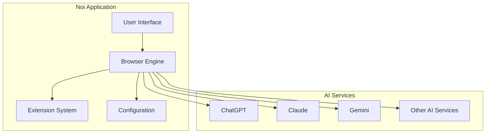

# Welcome to Noi Documentation

Noi is an AI-enhanced, customizable browser designed to streamline your digital experience with AI services.

## 🚀 Quick Start

- **Users**: Download Noi from [GitHub Releases](https://github.com/lencx/Noi/releases)
- **Developers**: Check out the [Technical Architecture](./ARCHITECTURE.md)
- **Extension Developers**: See the [Extension Development Guide](./EXTENSION_DEVELOPMENT.md)

## 📖 Documentation Sections

### Technical Documentation
- **[Architecture Overview](./ARCHITECTURE.md)** - Complete system architecture with diagrams
- **[Extension Development](./EXTENSION_DEVELOPMENT.md)** - Build extensions for Noi
- **[Configuration System](./CONFIGURATION.md)** - Manage settings and configurations
- **[Development Guide](./DEVELOPMENT.md)** - Set up development environment

### Key Features

- **AI Support**: ChatGPT, Claude, Gemini, Grok, DeepSeek, GitHub Copilot, and more
- **Browser**: Customizable browsing with AI website integration
- **Extensions**: Chrome-like extension system for enhanced functionality
- **Prompts Management**: Robust prompt customization and management
- **Themes**: Multiple theme options including Light, Dark, System, and custom themes
- **Cache Mode**: Unique browsing experience without traditional tabs
- **Cookie Isolation**: Multiple accounts support for the same website

## 🎯 Getting Started

### For End Users
1. [Download Noi](https://github.com/lencx/Noi/releases) for your platform
2. Install and launch the application
3. Configure your preferred AI services
4. Start exploring AI-enhanced browsing

### For Developers
1. Read the [Architecture Documentation](./ARCHITECTURE.md)
2. Set up your [Development Environment](./DEVELOPMENT.md)
3. Explore the [Extension System](./EXTENSION_DEVELOPMENT.md)
4. Check the [Configuration Guide](./CONFIGURATION.md)

## 🔧 System Requirements

- **Windows**: Windows 10 or later (x64)
- **macOS**: macOS 10.15 or later (Intel/Apple Silicon)
- **Linux**: Ubuntu 18.04+ or equivalent (x64)

## 🌐 Supported AI Services

### Popular AI Platforms
- [ChatGPT](https://chatgpt.com)
- [Claude](https://claude.ai)
- [Google Gemini](https://gemini.google.com)
- [Grok](https://grok.com)
- [GitHub Copilot](https://github.com/copilot)
- [HuggingChat](https://huggingface.co/chat)
- [Perplexity](https://www.perplexity.ai)

### Chinese AI Services
- 通义千问 (Qwen)
- 扣子 (Coze)
- 豆包 (Doubao)
- 智谱清言 (ChatGLM)
- DeepSeek

## 📊 Architecture Overview

## 🤝 Contributing

We welcome contributions! Please see our:
- [Development Guide](./DEVELOPMENT.md) for setup instructions
- [GitHub Repository](https://github.com/lencx/Noi) for issues and discussions
- [Extension Development](./EXTENSION_DEVELOPMENT.md) for creating extensions

## 📢 Community

- **Discord**: [Join our community](https://discord.gg/kq2HXcpJSQ)
- **GitHub**: [Star the project](https://github.com/lencx/Noi)
- **Issues**: [Report bugs](https://github.com/lencx/Noi/issues)
- **Discussions**: [Feature requests](https://github.com/lencx/Noi/discussions)

## 📄 License

Noi is open-source software. Check the [repository](https://github.com/lencx/Noi) for license details.